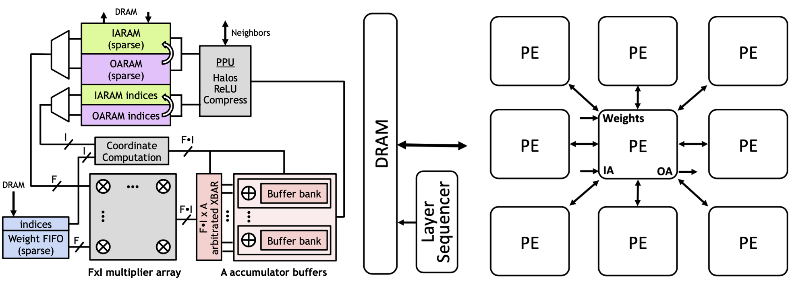

# SCNN: Cycle-Level Simulator Implementation
<p align='center'>


This repository holds the cycle-level simulator implementation of the SCNN architecture described in the paper [**SCNN: An Accelerator for Compressed-sparse Convolutional Neural Networks**](https://www.cs.utexas.edu/~skeckler/pubs/ISCA_2017_SCNN.pdf) (Parashar et al., ISCA 2017). This is a project that I conducted during my individual research at VIA Lab (Prof. Minsoo Rhu, KAIST).

## Introduction

In their paper, the authors propose "Sparse Convolutional Neural Network" or SCNN, which is an accelerator architecture for convolutional neural network layers, which are widely used in the area of deep learning and computer vision today. SCNN mainly focuses on the characteristics of the ReLU activation function as well as pruning in CNNs, which lead to considerable levels of sparsity in the input activations as well as filter weights. 

## Config Preparation

For configuration preparation, please refer to the [**config preparation guide**](./configs/README.md). 

## Installation & Execution

The g++ compiler that I have used for this project is as follows. There are no other environment requirements or dependencies. 
* Apple clang version 13.1.6 (clang-1316.0.21.2)
* Target: x86_64-apple-darwin21.4.0
* Thread model: posix

1\) Clone repository
```
git clone https://github.com/james98kr/SCNN_simulation.git
cd SCNN_simulation
```
2\) Compile source code into binary executable using the following command. This will create the executable file ``scnn`` in the main directory. 
```
make
```
3\) Assuming that the configuration file is properly set up, you can execute the binary using the following command:
```
./scnn {path_to_config_file}
```
Notice that the configuration files for GoogLeNet and VGGNet simulation are already given in the ``configs`` directory. You can run the executable with those configurations using the following commands:
```
./scnn ./configs/googlenet.yaml
./scnn ./configs/vggnet.yaml
```

## Test Output

When running the ``scnn`` executable, the following will be printed in the command line. The test output for GoogLeNet and VGGNet can be found in the ``logs`` directory. 

1\) The configuration for the SCNN microarchitecture

* Multiplier array size
* Crossbar port config
* Accumulator bank

```
Multiplier array size (F, I): (4, 4)
Crossbar port_in: 16
Crossbar port_out: 32
Accumulator bank number: 32
```

2\) Configuration for each convolutional layer

* Size of input tensor and weight tensor
* Processing Element (PE) configuration
* Output group size (Kc)
* Input activation and weight sparsity
* <b>Total number of cycles</b>
* Validation result (for each convolution, the result for SCNN is compared to the "golden convolution" result, which works as an answer key for checking the validity of the simulation)

```
Configurations for layer 0
- Input activation shape (N, C, H, W): (1, 192, 28, 28)
- Weight shape (K, C, S, R): (32, 192, 1, 1)
- Temporal PE config (PE_Num_H, PE_Num_W): (8, 8)
- Kc: 8
- Input activation sparsity: 0.04
- Weight sparsity: 0.57

Performing sparse convolution on layer 0...
tile_num: 64/64
- Total number of cycles: 240224
- Multiplier utilization: 0.652853
   - Total mult_array output size: 1.98809e+06
   - Mult_cycle: 190327

Performing golden convolution...
Performing validation for layer 0...
*** Validation Complete: Output correct for layer 0! ***
```

## Source / Header Files

All source files are stored in the ``src`` directory, and all the corresponding header files are stored in the ``include`` directory. Within ``src``, there is the ``scnn`` and ``simulator`` directories. Each holds the following:

* ``scnn``
    * ``accum_banks.cpp``: accumulator buffers that accumulate results from multiplier arrays based on index
    * ``config_arch.cpp``: configuration for SCNN microarchitecture
    * ``config_dataflow.cpp``: configuration for each convolutional layer
    * ``crossbar.cpp``: crossbar that distributes multiplier array outputs to accumulator bank buffers appropriately
    * ``datatypes.cpp``: defines various data types such as ``IO_element`` or ``W_element``, which store not only value but also index
    * ``golden_model.cpp``: works as an answer key for checking the validity of the simulation
    * ``ioram.cpp``: high-level implementation of the sparse RAM that holds the compressed versions of input activations and sends appropriate data to multiplier array
    * ``mult_array.cpp``: multiplier array that performs F x I Cartesian product
    * ``tensor.cpp``: defines the class ``Tensor_IO`` and ``Tensor_W``
    * ``weight_fifo.cpp``: high-level implementation of the sparse RAM that holds the compressed versions of filter weights and sends appropriate data to multiplier array
* ``simulator``
    * ``config_parser.cpp``: code for parsing the input ``.yaml`` configuration files and creating ``config_arch`` and ``config_dataflow`` instances
    * ``conv_layer.cpp``: defines a wrapper class that actually performs sparse convolution and keeps track of the number of cycles